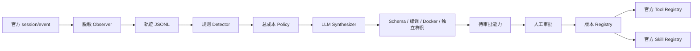

# 架构与兼容性

## 已核对的上游

源码：https://github.com/deepseek-ai/deepseek-harness/tree/5badb15009ae1756c3afe0ae0cef1faafc290ccc 。本地参考副本位于工作区 `.reference/`。DSH 包版本 `0.2.1-alpha.1`、Cordis `4.0.5-alpha.1`、Schemastery `3.18.5-alpha.1`；精确固定版本，避免 npm 的旧 latest 标签。

另已核对并验证本机签名 Desktop 发布运行时 DSH `0.2.0-rc.2` / Cordis `4.0.4` / Schemastery `3.18.4`。peer 仅允许这两个已验证的明确版本，不使用兼容性豁免。账号渠道使用官方 `deepseekAccount` 服务，凭据解析归官方所有；界面 DeepSeek-V41-Flash 的实际模型 ID 是 `deepseek-flash`。

实际阅读 `docs/architecture.md`、`docs/user/develop/basic/{index,config,tool,publish}.md`、`docs/subsystems/{tools,skills}.md`、`docs/tool-execution-pipeline.md`，并核对如下源码：

| 扩展点 | 源码 | 用法 |
|---|---|---|
| `apply(ctx, config)`、`inject`、`ctx.effect` | `vendor/cordis/src` | Cordis 插件加载和资源清理 |
| `session/event(session, event)` | `packages/core/session/src/index.ts:74` | 提交后观察，不修改已提交事件 |
| `SessionEvent` 判别联合 | `packages/core/session/src/types.ts:281` | `tool/call`、`tool/result`、`assistant/message.usage`、turn/step 关联 |
| `ctx.tools.register(definition)` | `packages/core/tools/src/index.ts:1063` | JSON Schema 输入、canonical output、render、execute；返回 disposer |
| `ctx.skills.register(skill)` | `packages/skill/skill/src/index.ts` | 运行时注册，官方 registry 负责发现/优先级/调用 |
| `ctx.llm.stream(options)` | `packages/llm/llm/src/index.ts:1128` | 使用已有模型路由，不另造 Harness API |
| `dsh.bundle.patch` | 官方 publish 教程及 `packages/bundle/*/package.json` | npm bundle 的 YAML insert 配置层 |

`tools/result` 提供最终冻结结果及 PTC 子调用；Phase 1 以持久 Session 事件为输入，耗时为 call→result 间隔（含调度/审批），不是纯工具 CPU 时间。Token 来自 assistant/message 的实际 usage；缺失保留 null，不推算为 0。原始提示、输出、文件内容、图片及模型流默认不存储。

## 数据流

Observer 同步生成小型不可变副本、将写入排入有界队列；I/O 错误被隔离并计数，不能中断 Agent。卸载先取消监听再等待写队列。taskId 默认 sessionId + turn，避免记录用户提示。工具名称和错误代码用于统计；脱敏匹配字段名、Bearer/API key、邮箱、私钥，并限制深度/大小。明确的隐私边界：启用 payload 记录仍需调用者审查业务敏感字段。

不重复实现官方工具调度、Skill catalog 或审批服务。能力审批是插件独立管理入口，必须由人在 CLI 操作，模型工具无法批准自身。默认 Observe，工具代码验证必须在 Docker 内执行；没有 Docker 就失败，不回退宿主。插件注册恢复使用同一官方 registry，卸载时 disposer 撤销贡献，能力文件保留。
